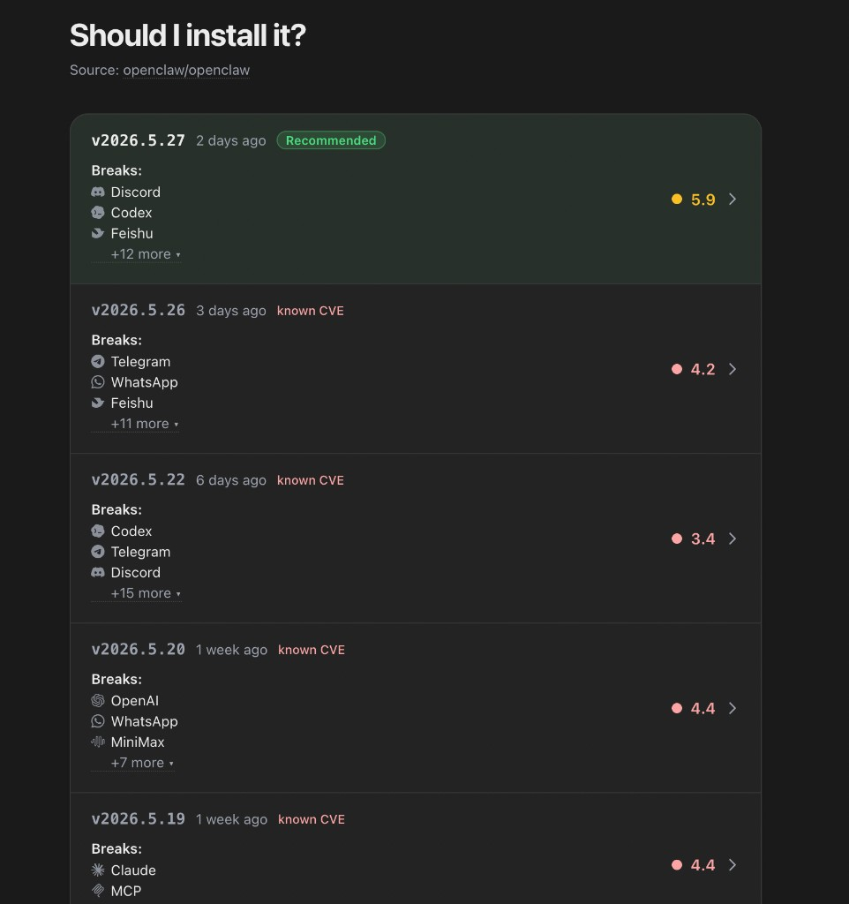

# OpenClaw Release Radar

OpenClaw Release Radar is a small dashboard that answers:

> Which OpenClaw stable release should I install right now?

It watches `openclaw/openclaw`, pulls releases, issues, comments, and advisory data from GitHub GraphQL, classifies issue impact with OpenAI, stores the result in SQLite, and serves a local web UI plus JSON API.

The score is a triage aid, not a guarantee. Inspect `/api/releases/:tag/review` before acting on a recommendation.



## Current Status

This is now maintained from:

```text
https://github.com/hannesrudolph/openclaw-release-radar
```

It is intended to be deployed under your own domain. The old `isitstable.iclaw.digital` / `radar.iclaw.digital` references are not part of this setup.

## Quick Start

Requirements:

- Node.js `>=22.5`
- npm
- GitHub token
- OpenAI API key

Install dependencies:

```bash
npm install
```

Create local config:

```bash
cp .env.example .env
```

Edit `.env`:

```bash
GITHUB_OWNER=openclaw
GITHUB_REPO=openclaw

OPENAI_MODEL=gpt-5.5

PORT=8787
DB_PATH=./data/radar.db
REFRESH_ON_STARTUP=false
REFRESH_MINUTES=0
RELEASES_LIMIT=10
FULL_ISSUE_BACKFILL=false
MAX_ISSUE_PAGES=500
COMPARISON_API_ENABLED=false
```

Secrets can live in your shell/global environment instead of `.env`:

```bash
GITHUB_PERSONAL_ACCESS_TOKEN=ghp_your_github_token
OC_OPENAI_API_KEY=sk-your_openai_key
```

The app also accepts the conventional names `GITHUB_TOKEN` and `OPENAI_API_KEY` if you prefer those.

Run the app:

```bash
npm run dev
```

Open:

```text
http://127.0.0.1:8787
```

Refresh the database manually when you want new evidence and scores:

```bash
REFRESH_MINUTES=0 RELEASES_LIMIT=10 CLASSIFY_CONCURRENCY=50 npx tsx -e "import { refresh } from './src/lib/refresh.ts'; refresh().then(console.log)"
```

The first refresh can take a few minutes because it backfills GitHub data and classifies issues. Later refreshes only process changed issues.

`REFRESH_ON_STARTUP=false` keeps the web server from writing to the DB when you only want to inspect the UI. `REFRESH_MINUTES=0` disables periodic refreshes. Set `FULL_ISSUE_BACKFILL=true` when you need a complete issue-history pass; this is intentionally expensive. If the crawl reaches `MAX_ISSUE_PAGES` before exhausting GitHub pagination, the backfill remains incomplete, refresh records the page-cap stop in doctor metadata, and scoring is refused until a complete crawl runs.

For a reproducible rebuild from an empty local database, wipe every ignored SQLite file, run a full issue-history refresh, then verify the persisted audits:

```bash
rm -f ./data/*.db ./data/*.db-* ./data/*.db-shm ./data/*.db-wal
FULL_ISSUE_BACKFILL=true REFRESH_MINUTES=0 RELEASES_LIMIT=10 CLASSIFY_CONCURRENCY=50 npx tsx -e "import { refresh } from './src/lib/refresh.ts'; refresh().then(console.log)"
npm run verify:local
npm run verify:live
```

`npm run verify:live` requires `npm run dev` to be serving `http://127.0.0.1:8787`.

## Internal Calibration Snapshot

During model calibration, you can capture an external rendered UI snapshot as a temporary internal benchmark:

```bash
npm run scrape:upstream
```

The snapshot is stored separately from local model data after validating the rendered release rows. It is for internal review only, is not shown in the product UI, and does not overwrite local release scores. Review endpoints do not expose upstream comparison fields. `/api/comparison` is disabled unless `COMPARISON_API_ENABLED=true`.

The older public JSON snapshot importer is still available as a one-off utility:

```bash
npm run import:public-snapshot -- --allow-overwrite-local-releases https://isitstable.iclaw.digital/api/public
```

This is legacy recovery tooling. It refuses to run unless `--allow-overwrite-local-releases` is present because it writes external data into the local release table. If the local DB already has scored releases, it also requires `--allow-overwrite-scored-local-releases` before touching those rows. It imports release metadata only; external scores/recommendations are not treated as local audit-backed scores. Run a local refresh after import. Do not use it as a benchmark source; prefer `scrape:upstream`.

## Tokens

### GitHub

`GITHUB_PERSONAL_ACCESS_TOKEN` or `GITHUB_TOKEN` is required because the app uses GitHub GraphQL.

For the public `openclaw/openclaw` repo, a classic token with `public_repo` is enough. For a private target repo, use a token that can read that repo.

If you already use the GitHub CLI:

```bash
gh auth status
gh auth token
```

Export the token globally as `GITHUB_PERSONAL_ACCESS_TOKEN`, or put it in `.env` as `GITHUB_TOKEN`.

### OpenAI

`OC_OPENAI_API_KEY` or `OPENAI_API_KEY` is required for issue classification. Without it, GitHub data can be fetched but release scoring will fail.

## Verify It Works

Health check:

```bash
curl http://127.0.0.1:8787/api/health
```

Refresh status:

```bash
curl http://127.0.0.1:8787/api/status
```

Main public payload:

```bash
curl http://127.0.0.1:8787/api/public
```

Top-level `schemaVersion` is the public payload contract version. Current value: `3`.

Score review:

```bash
curl http://127.0.0.1:8787/api/releases/v2026.6.10/review
```

Release audit invariant check:

```bash
npm run doctor
npm run doctor -- --api-base http://127.0.0.1:8787
npm run verify:local
npm run verify:release-audit
npm run verify:release-audit -- --api-base http://127.0.0.1:8787
npm run verify:live
npm run ui:smoke
```

`npm run doctor` is a read-only SQLite health report. It prints DB path/size, table counts, latest scored stable, recommendation count, score-write provenance, classification coverage, source freshness, closure-proof coverage, PR reachability counts, comparison snapshot state, warnings, and failures. It also checks the latest recorded issue crawl metadata, including missing crawl metadata on scored DBs, page-cap stops, truncated comment scans, issue classification failures, release-metadata/artifact/release-check/advisory/monitored-release evidence refresh failures, durable `ingestion_evidence_failures` rows recorded after the latest score, and source rows that changed after the latest score. Refresh treats truncated comment scans as score-blocking incomplete evidence before score persistence, because commenter breadth and comment-derived proof must be complete enough to audit. Use `--api-base http://127.0.0.1:8787` to also check the running local server. Add `--fail-on-warnings` when stale evidence warnings should fail the command.

`verify:local` and `verify:live` start with `npm run doctor -- --fail-on-warnings` and use `--all` internally, so they check every scored stable release and fail if a scored release lacks a score audit, the latest evidence is stale, or the latest crawl recorded classification/evidence failures that could affect the current score. Release metadata, release-window context, artifact verification, release commit checks, and security advisories are score-affecting evidence; refresh records failures for those sources and refuses score persistence instead of falling back to stale rows.

Score writers also enforce complete classification coverage, unambiguous stable release windows, and unambiguous issue open intervals before updating release rows or score audits. If any release has `classifiedIssueCount !== rawIssueCount`, a stable release has a missing/duplicate `published_at`, or a fetched reopen event has no preceding close event for that issue, `persistReleaseScoreRun` refuses the whole run instead of writing a partial or under-classified score. Every successful score write records `score_persistence_last_run` in `meta`, including writer source, scope, release tags, score timestamps, recommended tag, model/prompt versions, and issue-crawl coordinates. Doctor fails if the current audited stable rows do not match that recorded release tag set, model version, or prompt version.

GitHub GraphQL ingestion also fails closed on malformed nested evidence connections. Missing `nodes`, null nodes, missing `pageInfo`, or `hasNextPage` without `endCursor` on issue labels, comments, label timelines, fix evidence, release check contexts, release pages, issue pages, or advisory pages is treated as an ingestion failure, not as empty evidence.

Score-blocking ingestion failures are appended to `ingestion_evidence_failures` with run/source/scope/message context as soon as they happen. If issue-page comments, label timelines, or fix evidence fail before normal crawl metadata can be completed, refresh writes `stopReason: "evidence_failure"`, persists the failure examples, and refuses score persistence.

When GitHub returns a partial GraphQL response because an issue alias cannot be resolved, batch helpers recover only when the caller provides an explicit missing-alias reporter. Refresh records the skipped alias as a durable score-blocking evidence failure. Other callers fail closed instead of silently treating comments, labels, or fix evidence as empty.

Audit freshness follows the newest audited stable release, including null-score `wait` rows. Recommendation counts still require a numeric score, so wait/gated audits do not become install candidates.

Scoring rules and evidence sources are documented in [docs/scoring-model.md](docs/scoring-model.md).

A healthy `/api/status` response has:

```json
{
  "refreshing": false,
  "lastError": null
}
```

A healthy completed refresh also records `meta.issue_crawl_last_run`, which `npm run doctor` reports under `ingestion.issueCrawl`:

```json
{
  "ingestion": {
    "issueCrawl": {
      "stopReason": "exhausted",
      "classificationFailures": [],
      "evidenceRefreshFailures": [],
      "scorePersisted": true
    }
  }
}
```

## API

| Endpoint | Purpose |
| --- | --- |
| `/api/health` | Basic process and target repo check |
| `/api/status` | Refresh state and last error |
| `/api/releases` | Dashboard release data; each row includes `auditLinks` for review, issue evidence, closure proofs, and PR reachability |
| `/api/releases/history` | Score history; each row includes `scoredAt`, `scoreAudit`, `dataFreshness`, and `auditLinks` so chart points can be audited |
| `/api/public` | Main install recommendation payload; each release row includes `auditLinks` for audit drill-down |
| `/api/releases/:tag/review` | Local score audit for one release; no upstream comparison fields; includes `local.sourceProvenance` with `sourceMode`, score/audit timestamp alignment, freshness sources, and raw-row links |
| `/api/releases/:tag/review/issues` | Paginated current-DB issue-evidence rows for one release; supports comma-separated `tier`, `impact`, `state`, `sentiment`, `severity`, `functionality`, `scope`, `affectedUsers`, `fieldConfirmed`, `minWeight`, `maxWeight`, `sort`, `direction`, `summaryOnly`, plus `limit` and `cursor`; includes `sourceMode`, `scoredAt`, `dataFreshness`, `tierInfo`, `summaryByTier`, `filteredSummary`, `filteredCountsByTier`, `filteredSummaryByTier`, and `totals` |
| `/api/releases/:tag/review/closure-proofs` | Paginated current-DB closure-proof rows for one release; supports validated `status`, audit enum `riskDisposition`, `limit`, and `cursor`; includes `sourceMode`, `scoredAt`, `dataFreshness`, human-readable risk labels, filtered/unfiltered status counts, and filtered/unfiltered risk-disposition counts |
| `/api/releases/:tag/review/reachability` | Paginated current-DB PR reachability rows for one release; supports `status`, `pr`, `limit`, and `cursor`; includes `sourceMode`, `scoredAt`, `dataFreshness`, and filtered/unfiltered status counts |
| `/api/comparison` | Internal temporary upstream-comparison payload |

The structured score explanation appears at these paths:

- `/api/releases`: `release.explanation`
- `/api/public`: `release.explanation`
- `/api/releases/:tag/review`: `local.components.explanation`
- `/api/comparison`: `release.local.components.explanation`

That structured `explanation` object contains:

- `schemaVersion`: explanation contract version. Current value: `1`.
- `scoreLedger`: canonical score math rows with stable row keys/labels, subtotal, cap rows, score after caps, and final rounded score.
- `positives` / `limits`: human-readable evidence lines for the UI.
- `positiveDetails` / `limitDetails`: matching machine-readable entries with stable reason `code`, mandatory canonical `label`, optional `metrics`, `buckets` / `riskBuckets`, and `issueRefs`.
- `verdict`: install-facing interpretation of the score.

The `/api/releases/:tag/review` `local.input` and `local.components` objects also expose `schemaVersion`. Current value: `1`.
The `/api/releases/:tag/review` `local` audit object and `/api/public` / `/api/releases` `scoreAudit` summaries also expose `schemaVersion`. Current value: `1`.
The `/api/releases/:tag/review` `local.issueEvidence` object also exposes `schemaVersion`. Current value: `1`.
The `/api/releases/:tag/review` `local.gateEvidence` object also exposes `schemaVersion`. Current value: `1`.
The `/api/releases/:tag/review` `local.gateEvidence.labelTimeline` object also exposes `schemaVersion`. Current value: `1`.
The `/api/releases/:tag/review` `local.gateEvidence.releaseChecks` object exposes `schemaVersion`. Current value: `2`. `local.gateEvidence.artifactVerification.schemaVersion` current value: `1`.
The internal `/api/comparison` payload, upstream row, and delta objects also expose `schemaVersion`. Current value: `1`.
The `/api/status` and `/api/config` payloads also expose `schemaVersion`. Current value: `1`.
The `/api/releases/history` rows expose `schemaVersion`. Current value: `2`.
The `/api/public` payload, `/api/releases` rows, and `/api/public` release rows expose `schemaVersion`. Current value: `3`.

## Development Commands

```bash
npm run verify:ci
npm run verify:scripts
npm run verify:local
npm run verify:live
npm run doctor
npm run typecheck
npm test
npm run build
npm run verify:score
npm run verify:release-audit
npm run ui:smoke
npm run analyze:closure-proofs -- v2026.6.10
npm run backfill:issue-state-events -- --limit 10
npm run backfill:closed-windows -- --all
npm start
```

`npm run verify:ci` is CI-safe and does not require a local DB or running server.

`npm run verify:scripts` syntax-checks every `.mjs` maintenance script.

`npm run verify:local` requires the local SQLite DB, runs the health doctor in `--fail-on-warnings` mode, and checks persisted score/audit consistency for every scored stable release.

`npm run verify:live` also requires the local server at `http://127.0.0.1:8787`, runs the health doctor against that server in `--fail-on-warnings` mode, checks API/UI contracts for every scored stable release, and runs desktop/mobile browser layout smoke checks.

`npm run doctor` requires the local SQLite DB and emits a read-only JSON health report. Add `-- --api-base http://127.0.0.1:8787` when you want it to also verify the running server's recommendation and score timestamp match the DB; add `-- --fail-on-warnings` when warnings such as stale issue evidence should return a failing exit code.

`npm run backfill:issue-state-events -- --limit 10` fetches close/reopen timeline evidence and snapshots current labels for the current scored issue universe, so release attribution uses issue open intervals and latest-release scores have reproducible label evidence. It fetches all GitHub state evidence before writing snapshots/events, then writes snapshots, closure/reopen events, PR links, and PR rows in one transaction. Fetch failures, missing issue aliases, or write failures are recorded in `ingestion_evidence_failures` and abort without leaving partial state evidence.

`npm run check:release-pr-reachability -- v2026.6.10` rebuilds PR merge-commit reachability for one release tag. It stages the full replacement set before writing, then swaps rows in one transaction; git evidence failures leave the previous rows intact and are recorded as score-blocking `ingestion_evidence_failures`.

`npm run backfill:closed-windows -- --all` classifies raw closed-window issues missing current classification rows, stages all classification results before writing them in one transaction, reruns closure evidence, reachability, and closure proof for scored stable releases, then persists refreshed score rows and score audits in the final score transaction. Fetch, classification, classification-write, closure-evidence, reachability, or closure-proof failures are recorded in `ingestion_evidence_failures` and abort without leaving partial closed-window classification writes or fresh proof payloads attached to stale score audits.

`npm run dev` runs TypeScript directly with watch mode.

`npm start` runs the compiled app from `dist/`.

Refresh computes closure proof automatically. During refresh and closed-window backfill, closure proof updates side-table proof rows but leaves `release_score_audits` unchanged until the final score write succeeds, so a failed evidence pass cannot attach fresh proof payloads to stale scores. `npm run analyze:closure-proofs -- <tag>` is available when you want to rerun just that proof pass for inspection/debugging. It requires clean ingestion metadata before writing, requires the release to exist locally, and records score-blocking `ingestion_evidence_failures` if the proof pipeline aborts.

`npm run ingest:fix-provenance -- <tag>` is kept as a compatibility alias and now runs the same guarded closure-proof/reachability pipeline.

## Local Data

The SQLite database defaults to:

```text
./data/radar.db
```

To reset local data:

```bash
rm -f ./data/*.db ./data/*.db-* ./data/*.db-shm ./data/*.db-wal
```

Then restart:

```bash
npm run dev
```

This forces a fresh backfill and may spend additional OpenAI API credits.

## Deployment

The included GitHub Actions workflow deploys `main` over SSH.

Set this repo variable or secret to your real domain:

```text
DEPLOY_HEALTH_URL=https://your-domain.example/api/health
```

Set these SSH secrets:

```text
DEPLOY_SSH_HOST
DEPLOY_SSH_PORT
DEPLOY_SSH_USER
DEPLOY_SSH_KEY
```

The workflow builds the app, uploads a tarball, and calls this server-side installer:

```text
/usr/local/bin/openclaw-release-radar-install-release
```

That installer expects shared runtime config at:

```text
/opt/openclaw-release-radar/shared/.env
```

## Git Remote Setup

This repo should push only to your fork:

```text
origin   https://github.com/hannesrudolph/openclaw-release-radar.git
```

If you keep the original project as a reference remote, make it fetch-only:

```bash
git remote set-url --push upstream DISABLED
```

Current recommended shape:

```text
origin   https://github.com/hannesrudolph/openclaw-release-radar.git (fetch)
origin   https://github.com/hannesrudolph/openclaw-release-radar.git (push)
upstream https://github.com/iClawApp/openclaw-release-radar (fetch)
upstream DISABLED (push)
```

## License

MIT
